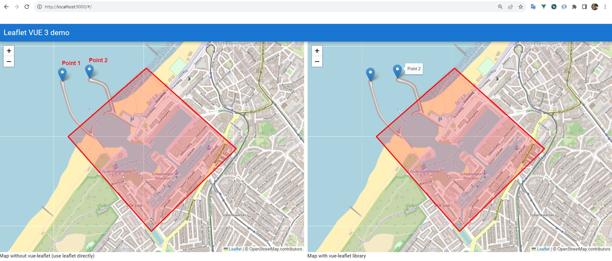
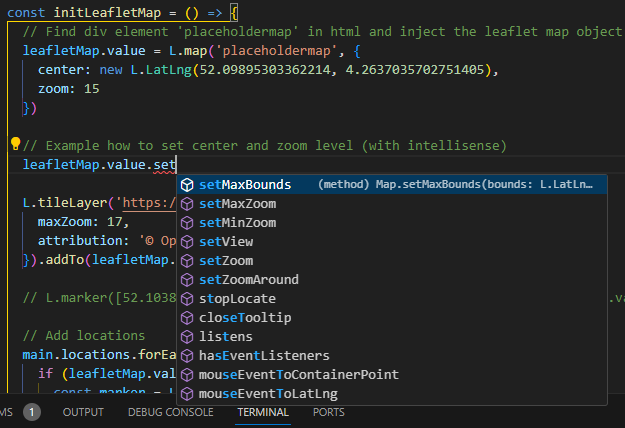

# Leaflet in vue 3

This demo project shows how to use [leaflet](https://leafletjs.com/) map in an vue 3 web application. in this example the [quasar framework ](https://quasar.dev/)was used, but this can be anything ([vuetify](https://vuetifyjs.com/), no framework).

Two approaches where used (in one webpage):

* Leaflet directly (left side of screenshot)
  
  Use the leaflet package directly  (install with `npm i leaflet`). The leaflet creation is all done in the script part. This gives a lot of control (any leaflet function can be used)

* With library [vue-leaflet](https://github.com/vue-leaflet/vue-leaflet) (right side of screenshot)
  
  Use the leaflet package through the vue-leaflet library (install with `npm i vue-leaflet`). The advantage is that the leaflet can be defined in the vue template. With reactive the elements can be bound. A disadvantage is that you have less control over the leaflet library. Should be possible with map reference, but I didn't find out how.



Used chrome as web browser to test (didn't check other browsers)

#### Build

Install the Node Package Manager ([NPM](https://docs.npmjs.com/downloading-and-installing-node-js-and-npm)).

```
npm install
npm run dev
# Open webbrowser on port 9001
```

### Intellisense

The leaflet library is in plain JavaScript. This demo uses typescript for validation and intellisense ([Visual Code Editor](https://code.visualstudio.com/)). In the project [@types/leaflet](https://www.npmjs.com/package/@types/leaflet) the typescript definitions for leaflet can be found. After installing with `npm i @types/leaflet` the definitions are placed in `node_modules\@types\leaflet`. Visual Code will automatically combine this type information with the leaflet library (leaflet is still JavaScript).



### File locations

| File                              | Description                       |
| --------------------------------- | --------------------------------- |
| \src\components\RawLeafletMap.vue | Approach one with plain leaflet   |
| \src\components\VueLeafletMap     | Approach two with vue-leaflet lib |


### Dependencies:

* [Quasar Framework](https://quasar.dev/)

* [Vue.js - The Progressive JavaScript Framework](https://vuejs.org/)

* [Leaflet](https://leafletjs.com/)

* [Vue-leaflet](https://github.com/vue-leaflet/vue-leaflet)

* [Node.js and npm](https://docs.npmjs.com/downloading-and-installing-node-js-and-npm)
